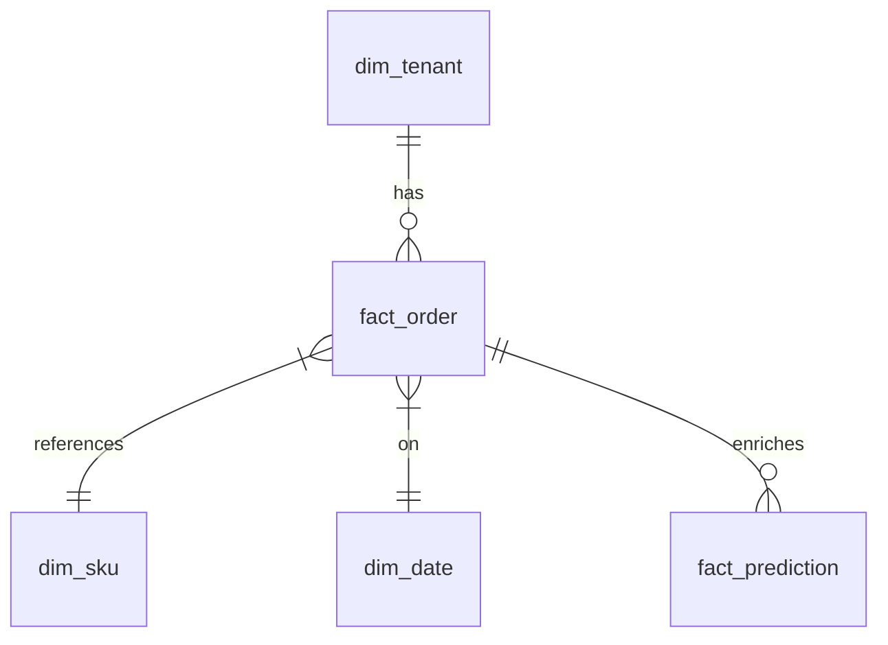

# Data Warehouse Schema – Aurora Analytics
**Owner:** Data Engineering Guild  
**Revision:** 1.3 (2025‑05‑29)

## 1  Conventions
* Naming: `fact_<subject>` for fact tables, `dim_<subject>` for dimensions.  
* All timestamps are `TIMESTAMP WITH TIME ZONE` (UTC).

## 2  Entity‑Relationship Overview (simplified)


## 3  Tables
### 3.1 dim_tenant
| Column | Type | Description |
|--------|------|-------------|
| tenant_id | UUID | PK |
| name | TEXT | Display name |
| region | TEXT | eu‑central‑1 / us‑east‑1 |
| tier | TEXT | standard / premium |
| created_at | TIMESTAMPTZ | |

### 3.2 dim_sku
| Column | Type | Notes |
|--------|------|-------|
| sku_id | TEXT | PK |
| tenant_id | UUID | FK dim_tenant |
| category | TEXT | |
| brand | TEXT | |
| initial_stock | INT | initial load value |

### 3.3 fact_order
Partitioned by `order_date`, clustered by `tenant_id`.
| Column | Type | |
|--------|------|---|
| order_id | BIGINT | PK |
| tenant_id | UUID | |
| sku_id | TEXT | |
| qty | INT | |
| price | NUMERIC(10,2) | |
| currency | CHAR(3) | ISO‑4217 |
| order_ts | TIMESTAMPTZ | raw event |
| order_date | DATE | derived |

### 3.4 fact_prediction
| Column | Type | |
|--------|------|---|
| prediction_id | BIGINT | PK |
| tenant_id | UUID | |
| sku_id | TEXT | |
| predicted_oos_at | TIMESTAMPTZ | |
| probability | NUMERIC(4,3) | |
| model_version | TEXT | |
| feature_vector | VARBINARY | |

## 4  Partition & Storage Strategy
* fact tables partitioned by day, stored in Parquet (Snappy), S3 bucket
  `s3://acme‑warehouse‑eu‑central‑1/`.  
* Retention: raw = 90 days, modeled = 2 years.  
* Metadata catalogue: AWS Glue.

## 5  Sample Queries
```sql
-- Daily OOS probability > 0.9
SELECT sku_id, DATE_TRUNC('day', predicted_oos_at) d,
       AVG(probability) p
  FROM fact_prediction
 WHERE probability > 0.9
   AND d BETWEEN '2025‑05‑01' AND '2025‑05‑31'
 GROUP BY sku_id, d
 ORDER BY p DESC
 LIMIT 100;
```

```sql
-- Gross merchandise value per tenant
SELECT t.name,
       SUM(o.qty * o.price) AS gmv
  FROM fact_order o
  JOIN dim_tenant t USING (tenant_id)
 WHERE order_date BETWEEN '2025‑01‑01' AND '2025‑03‑31'
 GROUP BY 1
 ORDER BY gmv DESC;
```

## 6  Data Quality SLAs
| Check | Threshold | Action |
|-------|-----------|--------|
| Null probability | < 0.1 % rows | quarantine partition |
| Price <= 0 | 0 rows | fail pipeline |
| Delayed ingestion | Δ > 30 min | alert SRE |

## 7  Monitoring
• Great Expectations suite runs nightly.  
• DataDog monitors Glue & Athena latency.  
• Redshift‑based Looker tiles refresh hourly.

-- End --