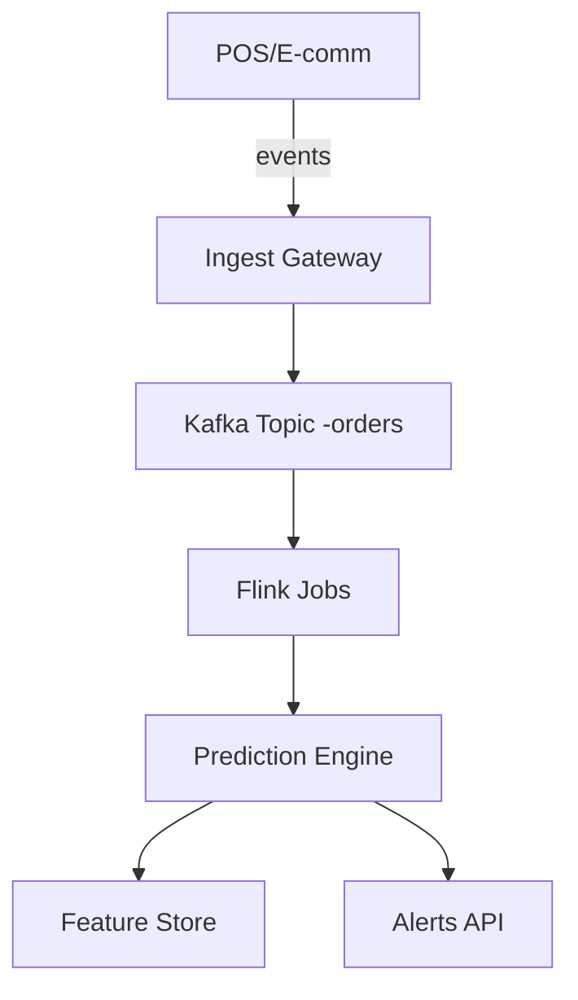

# Product Requirements Document – Project Aurora v2
**Document version:** 2.0  
**Author:** Sofia Nilsson (Principal PM)  
**Last updated:** 2025‑05‑29  
**Stakeholders:** Engineering, Design, Sales, Customer Success, Legal, Security

---
## 1  Purpose
Project Aurora expands Acme’s analytics ecosystem into real‑time, SKU‑level inventory prediction.
This PRD captures functional and non‑functional requirements for the 1.0 General Availability release
targeted for **2025‑09‑15**.

## 2  Background & Problem Statement
• 47 % of our mid‑market retail customers cite "stock‑out blindness" as their top operational pain.  
• Competitive gap: Competitors X & Y offer bulk nightly forecasting; none provide live stream‑based
  probabilities tied directly to a unified ingest pipeline.  
• Current Acme platform lacks short‑term prediction and proactive alerting.

## 3  Goals & Success Metrics
| Goal | Metric | Target |
|------|--------|--------|
| Reduce stock‑out incidents | Avg. weekly OOS events / tenant | ‑35 % within 90 days of enablement |
| Increase platform stickiness | Net Dollar Retention | > 126 % YoY |
| Drive upsell ACV | Incremental ARR per tenant | €4 k average |

## 4  Assumptions
1. Customers stream at most 30 K events/s; burst tolerance up to 45 K for < 5 min.  
2. 85 % of events originate from EU and NA regions, aligning with existing Kafka clusters.  
3. Existing Prediction Service can be refactored; no greenfield micro‑service.

## 5  User Personas
| Persona | Role | Needs |
|---------|------|-------|
| **Olivia Ops** | Inventory Planner | Wants predictive alerts at least 24 h pre‑stock‑out. |
| **Marco Dev** | E‑commerce Engineer | Seeks low‑latency API hooks (< 150 ms) to trigger UI banners. |
| **Diana Director** | VP Supply Chain | Requires board‑level KPIs and ROI dashboard. |

## 6  User Stories & Use Cases
1. *As Olivia*, I receive an email at 06:00 local showing any SKU with > 90 % OOS risk next day.  
2. *As Marco*, I embed the `/stock/alerts` API in checkout flow; banner appears if risk > 70 %.  
3. *As Diana*, I export quarterly reduction metrics as CSV for the board deck.

## 7  Functional Requirements
| # | Requirement | Priority | Acceptance Criteria |
|---|-------------|----------|---------------------|
| FR‑01 | Provide REST endpoint `/stock/alerts` | P0 | Returns ≤ 500 ms for 95 th percentile |
| FR‑02 | Support webhook push mode | P1 | Retry with exponential back‑off 5× |
| FR‑03 | Alert thresholds configurable per SKU | P0 | Persisted in `tenant_settings` table |
| FR‑04 | Dashboard widget “Live Risk Heatmap” | P1 | Renders < 2 s, auto‑refresh 60 s |
| FR‑05 | CSV export in UTC | P2 | Generates under 30 s for 100 K rows |
| FR‑06 | Role‑based access in dashboard | P0 | Only `analyst` & up see predictions |
| FR‑07 | Public GraphQL endpoint (read‑only) | P3 | Follows Relay spec |
| FR‑08 | Webhooks signed with HMAC‐SHA256 | P1 | Pass external verifier |
| FR‑09 | Alert deduping window | P2 | ≤ 1 duplicate / 10 K alerts |
| FR‑10 | Batch backfill API | P2 | Accepts up to 5 M events |
| FR‑11 | Self‑serve provisioning UI | P3 | Create tenant in < 30 s |
| FR‑12 | Multi‑language SDKs (JS, Python, Go) | P2 | Coverage parity |
| FR‑13 | System health endpoint `/status` | P0 | Returns 200, includes version |
| FR‑14 | SLA dash export (PDF) | P3 | Passes accessibility check |
| FR‑15 | Predictive model versioning | P1 | Metadata stored in feature store |
| FR‑16 | Soft‑delete predictions | P2 | GDPR compliant |
| FR‑17 | Bulk suppression list upload | P3 | Accept CSV up to 20 MB |
| FR‑18 | Live sandbox tenant | P2 | Resets nightly |
| FR‑19 | OAuth2 scopes granular | P1 | Minimum privileges |
| FR‑20 | Post‑incident email templates | P3 | Autopopulate with incident data |

## 8  Non‑Functional Requirements
1. **Scalability** – horizontal Kubernetes scaling; target 10 × event growth.  
2. **Availability** – 99.95 % monthly uptime (SLA).  
3. **Security** – SOC 2 Type II, ISO 27001 controls mapped.  
4. **Privacy** – GDPR compliant, data resides in tenant’s selected region.  
5. **Observability** – metrics: `prediction_latency_ms`, `alerts_generated_total`.

## 9  Data Flow

## 10  Release Plan
| Phase | Date | Scope |
|-------|------|-------|
| Alpha | 2025‑06‑30 | 3 design partners, EU cluster only |
| Beta | 2025‑08‑15 | 20 tenants, global |
| GA | 2025‑09‑15 | Public |

## 11  Dependencies
* Feature Store (v4.2) with online store patch.  
* Billing Service endpoint `/usage/events` (2025‑07‑01 GA).  

## 12  Risks & Mitigations
| Risk | Likelihood | Impact | Mitigation |
|------|------------|--------|------------|
| Event burst overload | Medium | High | Auto‑scale ingestion, rate‑limit |
| Model drift | High | Medium | Weekly re‑train, drift monitor |

## 13  Out of Scope
• Store‑level replenishment automation (will be in v1.5).  
• Predictive pricing.

### Appendix B – Glossary
**SKU:** Stock Keeping Unit; **OOS:** Out Of Stock; **SLA:** Service‑Level Agreement.